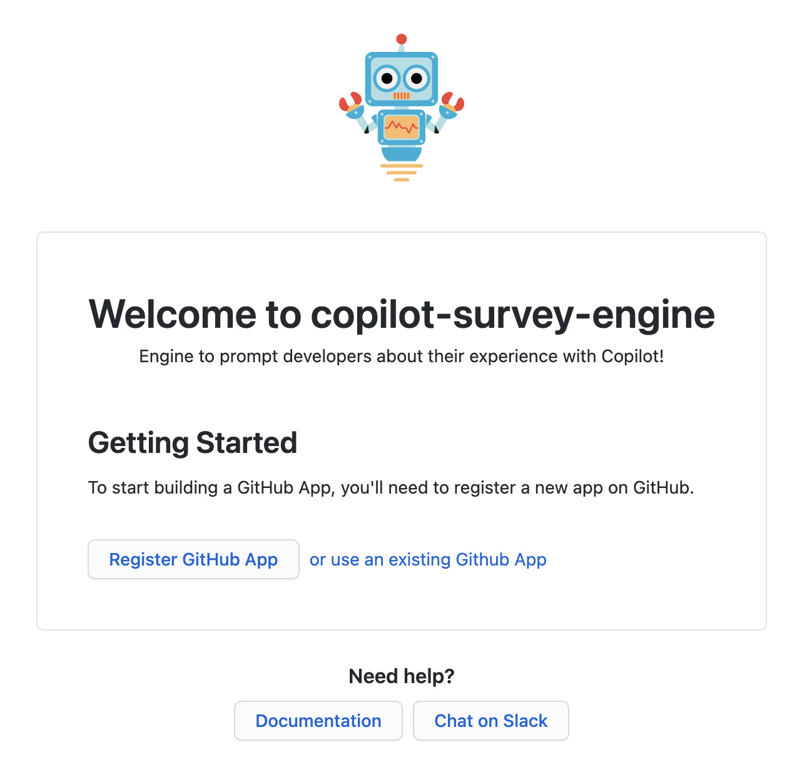
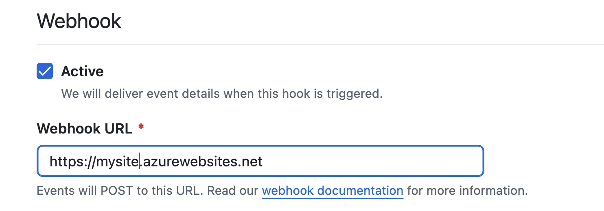

# copilot-survey-engine

> A GitHub App built with [Probot](https://github.com/probot/probot) to prompt developers about their experience with Copilot!

## App Objective

As more companies adopt GitHub Copilot, it becomes increasingly important to measure the benefits it brings to the organization. This survey is an effort to combine both quantitative and qualitative data. To improve validity of the quantitative responses, Developers are asked to document their rationale for the time-savings percentage they choose. 

Quantitative feedback from the Developer at the time of creating a PR provides valuable insights on the time savings experienced by the Developer. Time savings is needed first before other downstream impacts like velocity increases, or other improvements can happen. The level of granularity provides multiple feedback opportunities for Developers and can capture a variety of PRs so we can understand adoption challenges and improvement opportunities. If helpful, the Survey results may also be combined with Key Performance Indicators (KPIs) that the product provides to further contextualize the survey responses.

The survey responses are stored in a file called **results.csv** in the **copilot-survey-engine-results** branch to provide insights into how developers are using the tool, the value they report, and the challenges they encounter.

We hope that this project provides value to your organization, and we encourage you to contribute and build upon it. Your contributions can help further enhance the survey capabilities and provide even greater insights into the developer experience with Copilot.

## How it works

The application actively monitors three key events: the closure of a pull request, editing of an issue, and creation of an issue comment.

### How a survey gets created

When a pull request is closed, the app automatically creates an issue that prompts the user with relevant survey questions. Our application is equipped to handle multiple languages, including English, Spanish, Portuguese, and French. Selection will be made according to the `BOT_LANGUAGE` value in the .env file.

> **Note**: *If the env file does not contain a value for `BOT_LANGUAGE` the default language will always be English.*

### Sample screenshot of a survey 
### Copilot Usage Survey

1. ***Did you use Copilot in developing this PR? (If you select No, just answer question 5)***
- [ ] No
- [ ] Yes

2. Compared to your previous experience coding WITHOUT using Copilot, 

   ***How much less time did the coding take during this PR with Copilot?***
   
   (Example: The PR would normally take 5 days, but only took 4 days with Copilot then the answer is 20%)
- [ ] 0%
- [ ] > 0% but < 10%
- [ ] ≥ 11% but < 20%
- [ ] ≥ 21% but < 30%
- [ ] ≥ 31% but < 40%
- [ ] ≥ 41%

3. ***Describe your thought process for calculating (or estimating) the time saved in Question 2***
    
 - [ replace this line with your answer. ]

4. ***How often did you use Copilot in this PR?***
- [ ] All or most of the time
- [ ] About Half of the time
- [ ] Some of the time
- [ ] Not very much

5. ***What other information can you share about Copilot's ability to save you time coding?*** 

 - [ replace this line with your answer. ]

6. ***Where did you invest your Copilot Time Savings?***
- [ ] Resolve vulnerabilites
- [ ] Experiment, Learn and Wellness
- [ ] Technical debt and refactorization
- [ ] Work on other items in the backlog
- [ ] Other. Please explain in the comment

### Where does the app store survey results?

As we receive edits on the issue, the App will validate the responses received (options selected) and once all questions have been answered, the issue will be closed automatically and the responses will be saved into a results.csv file in the same repo in which the issue was created on a new branch called *copilot-survey-engine-results*.

## Setup. Deploy on your own environment

For doing a local deployment of this GitHub App, you will need to set up an environment with the following components:
- Web Server

The web server is the minimum requirement for this app to work and can be hosted on any environment of your choosing (cloud or on-prem). This guide will help you on the next steps!

### Step 1. Execute locally and configure secrets

To run the application on you local machine you'll need to have installed [NodeJS](https://nodejs.org/). Once you have it, you can access to the folder where you've cloned this project and run the following:

```sh
# Install dependencies
npm install

# Run the bot
npm start
```

Once the service is running, you will see a listening endpoint in your terminal. Please follow the link, and you will find a screen like the following image.



As a first time execution probot is prompting you for creating a new GitHub App or connect it with an existing GitHub App. As you complete the requested information, a .env file will get created in your local source code and all the private information regarding your GitHub App will be automatically written there. If you need guidance on how to configure your first GitHub App, please review this guide https://probot.github.io/docs/development/#configuring-a-github-app.

> **Note**: Make sure to delete the `WEBHOOK_PROXY_URL` value from the env file and confirm that all details regarding the GitHub App are correct.

### Step 3. Deploy your App!

Once you have your source code deployed in the web server or hosting platform of your choosing, finally go to your GitHub App General settings and update your webhook URL to reflect your Web Server URL. 



### Step 4. Test your App!

Make sure you have your app installed in at least one repo.

In such repo, create a pull request and close it (either close it or merge/complete it). Confirm that an issue has been created with the name "Copilot Usage - PR#XX". Answer the questions and confirm that the issue is closed and the data has been recorded into a file named results.csv 

Congrats!!!!! Enjoy and keep expanding the project. 

## Contributing

If you have suggestions for how copilot-survey-engine could be improved, or want to report a bug, open an issue! We'd love all and any contributions.

For more, check out the [Contributing Guide](CONTRIBUTING.md).

## License

[ISC](LICENSE) © 2023 Mabel Geronimo
